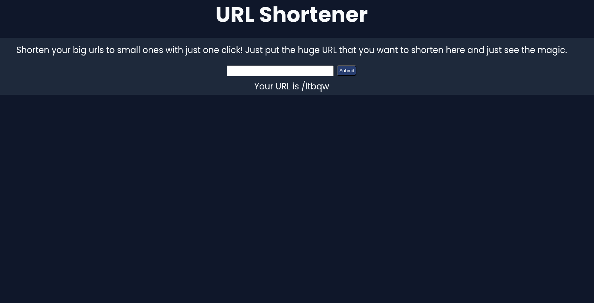

# URL Shortner
## Intro
URL shortner is a simple full stack tool which is used to shorten long and complex urls into small ones and make it simple.

## How does this work ?
It works on a simple system which is given below:
- Frontend: Frontend is what you see, here you put the long url (input) and it goes to backend using POST req.
- Backend: Backend is the main thing the input comes in then it takes the input then generate a random string and makes it an endpoint then it stores the data in database and gives the output back to the frontend.
- Database: It is used to store data in a platform and backend checks the data inside the databse when the endpoint is hit.
- Frontend (Again): Frontend's work begins again as it takes the output from the backend and displays it to the webpage.

## How to use it?
Using this URL shortener is very simple, you just have to visit https://url-shortener-1-2djf.onrender.com/ and add a long URL then it will shorten it and give back to you.

## Technologies Used:
- HTML/CSS: They are used to make the structure and style the home page.
- Frontend JS: Frontend Js is used to receive and send the input/output with backend.
- Node JS + Express JS: Node Js is the actual backend language I used to develop this application while express js is a framework used with nodejs. It's also used for redirecting.
- Mongo DB: Mongo DB is used to store data and co ordinate with backend for exchanging data.

## Inspiration
I just wanted to test my knowledge and develop a full stack application and this came into my mind. So, I made it!

